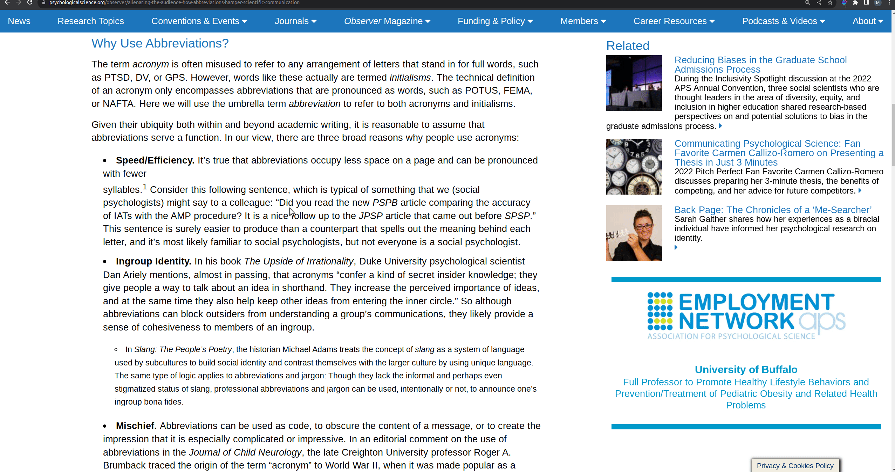

# AbbX - Abbreviation Explanation Chrome Extension



## Features

This is a basic Chrome Extension that takes the selected text and asks ChatGPT to resolve the abbreviations. Handy if you want to quickly look up an abbreviation without leaving your current window.

This project uses lxieyang's Chrome extension [boilerplate template](https://github.com/lxieyang/chrome-extension-boilerplate-react). Most instructions there apply here as well.

## API key

Until the project is ready to be published to the extension store, one can add an OpenAI API key and install the extension manually.

_./secrets.development.js_

```js
export default { OpenAPI: '123' };
```

## Installing and running

The project can be build via npm

```
npm install
```

```
npm run build
```

or start the webdev server

```
npm start
```

and then unpack the extension in `chrome://extensions/`.
